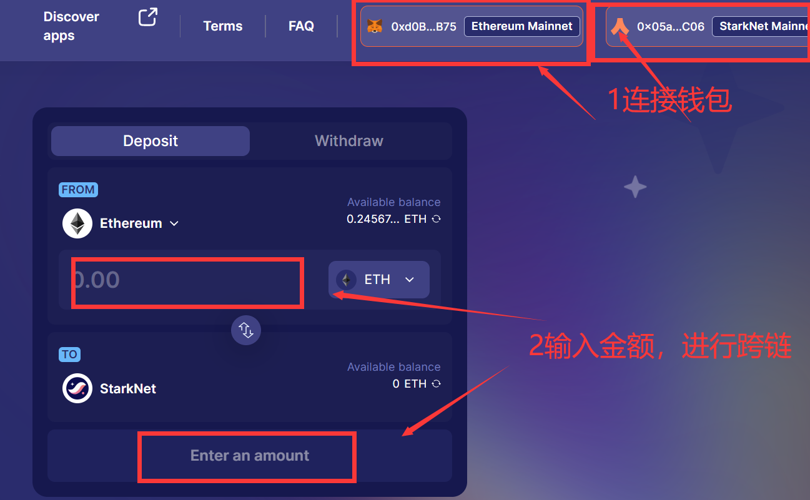
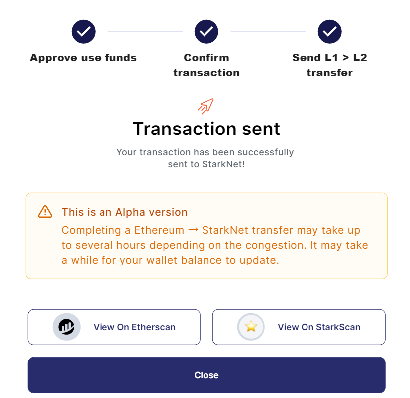
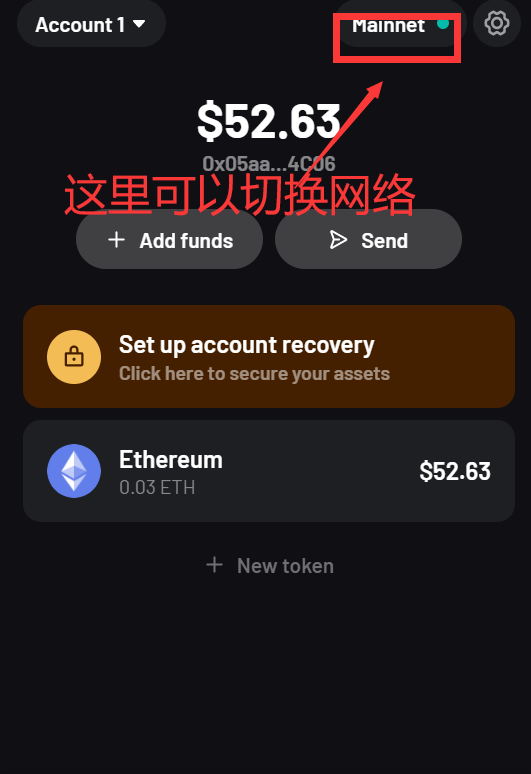
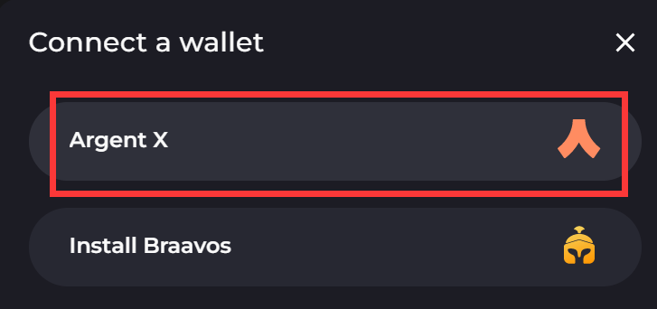
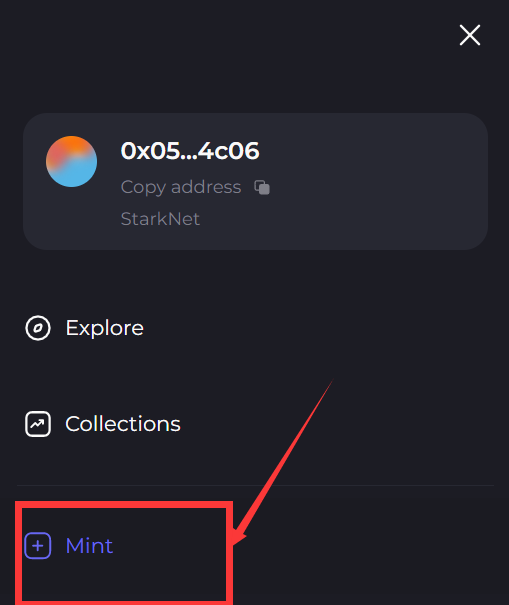
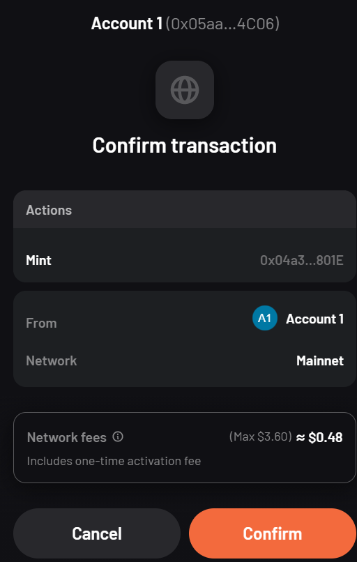
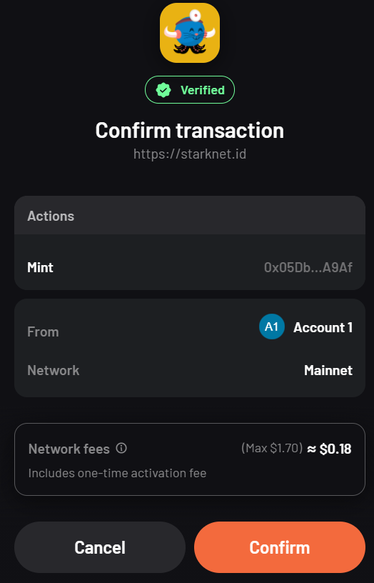

## StarkWare生态

### 0：为何做他

因为之前没做，错过了ARB空投（一万头曹尼玛）。

StarkWare的估值已经到了80亿，撸他，OP，ARB都发空投了，剩下的两个没有理由不发。

### 1：跨链充值

建议走官方桥（至少一次），给为了空投增加点权重。

https://starkgate.starknet.io/

我们需要两个钱包，一个是小狐狸钱包，一个是Argent X钱包。

按图操作，输入需要跨链的金额，点击按钮。

确认合约，等待几分钟后，跨链成功！（手续费几刀，可以等GAS费低点的时候做）

跨链交易成功！

我们去新钱包看看，有没有币。

默认第一个就是主网，不是的可以修改一下。

### 2：主网任务

#### 2.1：NFT

https://mintsquare.io/starknet

卧槽，怎么又是这个垃圾网站。

我们连接钱包，选择新的这个，后文简称AX（因为懒）。

然后我们选择mint 。

https://mintsquare.io/mint

可以参考另外一篇文章，[zkSync生态](../zksync.html)

我们选择图片上传，注意图片不支持jpg格式，支持png格式。

如果网络不好，可以重试几次，mint大概需要0.5刀。

建议至少mint一次。

如果你有钱，也可以去购买一个NFT。

#### 2.2：DID

https://app.starknet.id/identities

我们连接AX钱包。

然后选择最中间的+号。

域名注册要钱，自己考虑做不做。