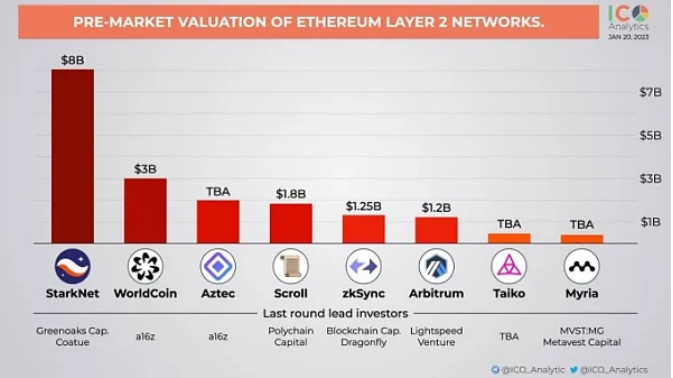

### 0：开始简介

我们从外网上面引用一张图片，这是一些L2的估值（有可能不准确）。

按照顺序卷就完事了。

### 1：StarkNet

[Greta做的生态表格](https://docs.google.com/spreadsheets/d/1xatD73XFnwqYxPuX7rbC50VQu88V89AoWJWt2ed36Kw/edit#gid=1524187970)

### 2：WorldCoin

### 3：Aztec

### 4：Scroll

[加密狗：Scroll测试网部署合约、发行代币教程](https://medium.com/@jiamigou/%E5%8A%A0%E5%AF%86%E7%8B%97%E6%95%B4%E7%BC%96%E7%A9%BA%E6%8A%95%E7%AC%AC163%E7%AF%87-%E5%9C%A8scroll%E6%B5%8B%E8%AF%95%E7%BD%91%E4%B8%8A%E9%83%A8%E7%BD%B2%E6%99%BA%E8%83%BD%E5%90%88%E7%BA%A6-%E5%8F%91%E8%A1%8C%E4%BB%A3%E5%B8%81%E7%9A%84%E6%95%99%E7%A8%8B-58e239ba961d)

### 5：Arbitrum(已发币空投)

### 6：Taiko

[宣城小科比：Taiko二期教程](https://mirror.xyz/0xc9f6977cF31F9deCdD2c24DF92aa621e4259469B/kTeQPitcE9J3Mlh54XGQhO9mnQtzcampWetTRV2mlSQ)

[鸭鸭：Taiko思维导图](https://twitter.com/0x_irisl/status/1639915667121139712)

[加密狗：Taiko跑测试节点](https://medium.com/@jiamigou/%E5%8A%A0%E5%AF%86%E7%8B%97%E6%95%B4%E7%BC%96%E7%A9%BA%E6%8A%95%E7%AC%AC157%E7%AF%87-%E5%A6%82%E4%BD%95%E5%9C%A8taiko-alpha-2%E4%B8%8A%E5%AE%89%E8%A3%85%E8%8A%82%E7%82%B9-%E6%8C%96%E7%9F%BF%E6%95%99%E7%A8%8B-c63dee73feb6)

### 7：Myria

[宣城小科比：Myria0撸教程](https://mirror.xyz/0xc9f6977cF31F9deCdD2c24DF92aa621e4259469B/0ag0QYyRDxKjjxutUG6cMeitGo2kBp80NirL3U4edBo)

