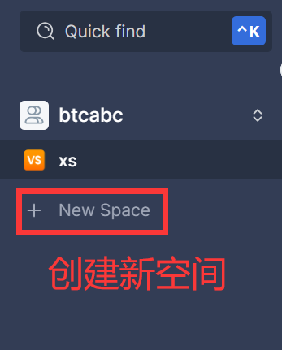
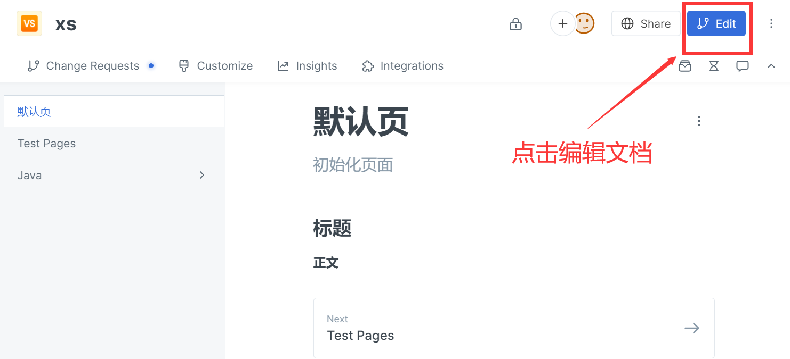
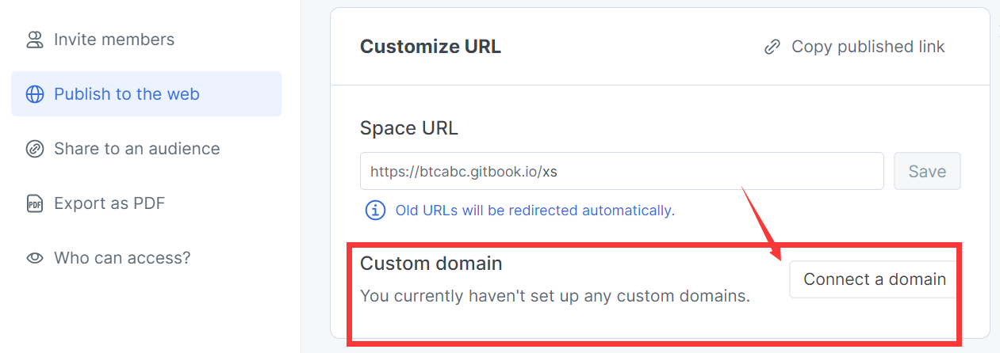
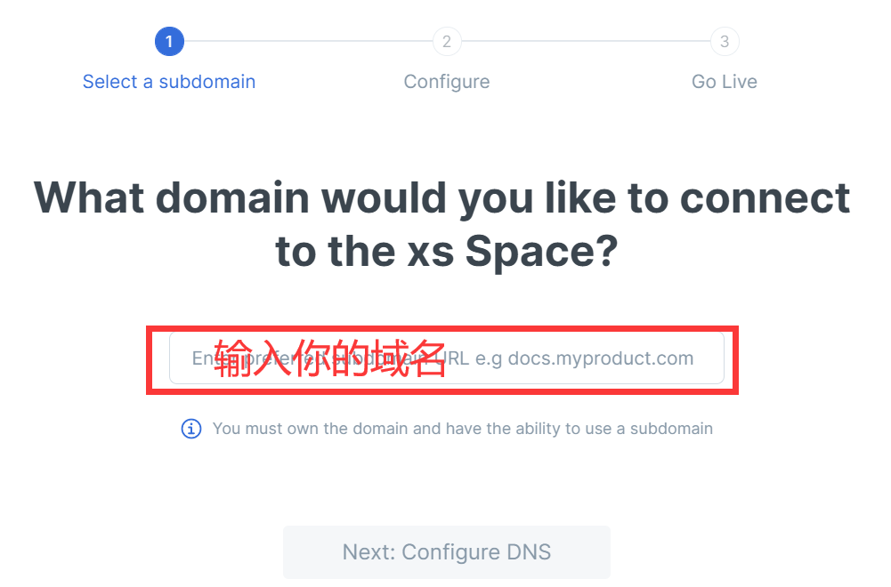
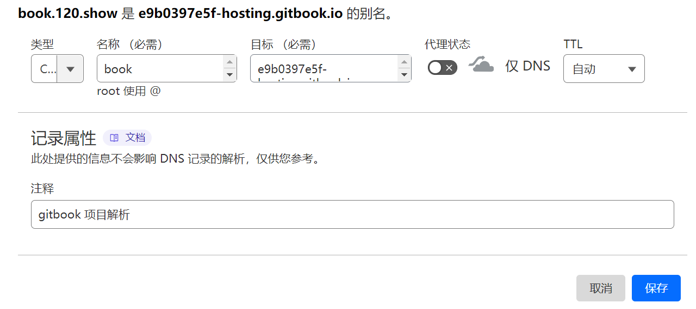
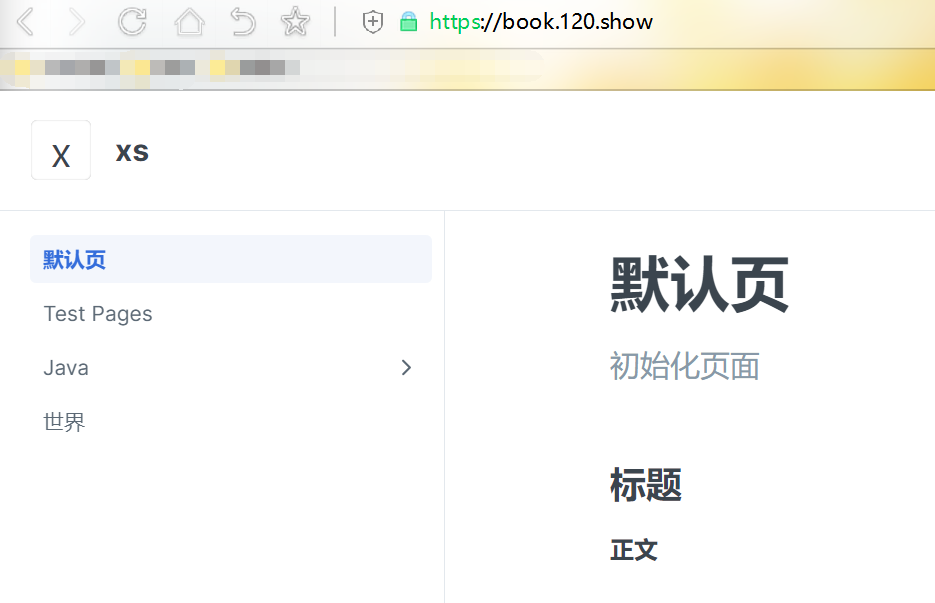

[TOC]

# GitBook体验

### 0前言：

最近在看文章的时候，发现大宇写的东西，看了看确有收获。文章最后提到了一个他自己的导航，我记得他之前是请人定做了一个的。现在是换用GitBook提供的文档支持。

> 他的导航：https://btcdayu.gitbook.io/dayu/

从网址上分析，该站的顶级域名为：gitbook.io

是一个信息类（io域名）的git托管的文档协作平台。

btcdayu前缀是团队或用户，有些类似于语雀。

dayu后缀是项目，这一点在很多产品里面都是一致的。

该产品目前国内可以直接访问，并没有被墙，以后有被墙的可能。

于是，我也尝试注册一个账号。

### 1官网：

官网：https://www.gitbook.com/

我们选择左侧的免费开始。

当然，如果你有Github从右侧选择也可以。

我们输入邮箱，过一会儿有验证邮件到邮箱，我们点击即可。

输入要创建的组织（团队），组织名唯一，比如上面的：btcdayu

选择组织类型。

我们注册成功后，创建新空间 (你可以理解为项目或者Github仓库)。

他会给你生成默认页（非中文），就是相当于网站的首页，类似于index.html。

其他的网页，比如上图的Test Pages，他在生成地址的时候是：

> 用户名.gitbook.io/空间名/网页名
>
> https://btcabc.gitbook.io/xs/test-pages
>
> 我们的网页名是：Test Pages ，他生成的名字是：test-pages，首先他忽略大小写，其次用-代替空格

我编辑一个中文标题的页面：

> 标题：世界
>
> 地址：https://btcabc.gitbook.io/xs/shi-jie
>
> 很明显，他把汉语换成了拼音，也用空格隔开了。如果中文标题太长，那么网址就非常长。

我还编辑了一个有层级的页面：

> 首先，我编辑了一个只有标题的页面：Java
>
> 然后，我在该页面下面继续添加一个页面，起名为：1安装
>
> 最后，得到我的网址：https://btcabc.gitbook.io/xs/java/1-an-zhuang

你可以插入图片，如果你上传本地文件，他的中心服务器会帮你保存，文档是md渲染的。

> 官方还可以定制一些插件，最重要的是，还可以邀请协调作业（这一点很重要）。
>
> 貌似还资产自定义域名，我下面演示一下。

我们点击项目右侧三个点，然后修改一下web路径。

选择自定义domain。

输入你的域名。

比如我自己填入：book.120.show

当然，你可以输入自己的顶级域名，比如：xxx.com

我们需要添加DNS解析，上图已经把解析的类型CNAME，解析名称Book，解析值都给出来，我们依次复制就好了。

以Cloudflare为例（因为在所有的服务商中，他的DNS响应速度最快）：

你可以不用设置代理，代理就是中间再加一层，你访问项目，通过cloudflare访问。

很明显，这里我们暂时不需要（等到国内被墙的时候，你就需要打开它了）。

第三步是：等待DNS生效（cloudflare几乎是一分钟左右，其他注册商在1小时左右）。

上图就是完成的标志。

现在你可以访问：https://book.120.show/

### 2本地：

参考文档：[GitBook操作指南](https://songlu-cube.gitee.io/courseware-gitbook-demo/)

该文档就是通过本地部署方案的GitBook，托管到了Gitee（因为国内访问稳定）。

