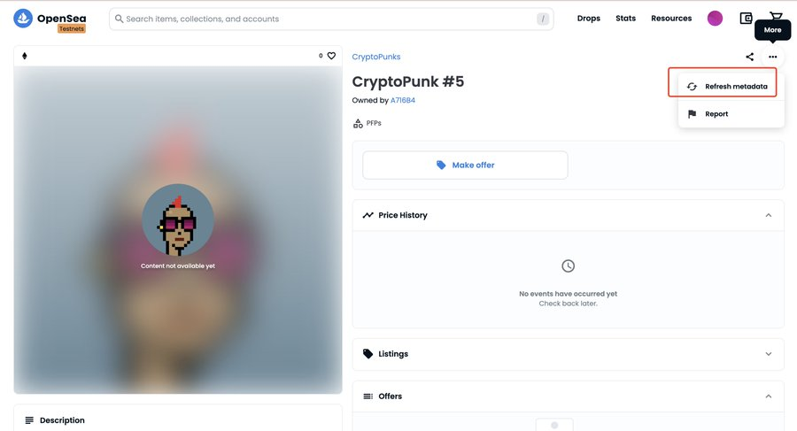

> 本教程里面示范的NFT已经全部mint完，但是你可以学习如何mint一个NFT。
>
> 网络：Goerli测试网  测试燃料：GETH
>
> 原文为推特[@小马哥](https://twitter.com/ponyweb3_eth) 的推文，该项目也是他创建的，在Goerli测试网上的CryptoPunks。
>
> 文：先圣        性质：转载/改编

[TOC]

## 在Goerli测试网上免费mint一个加密朋克NFT

> 免费领取你的CryptoPunks（加密朋克），已mint完。

### 1）免费领取 CryptoPunks 真带劲啊

虽然是平行世界的 CryptoPunks但所有的元数据、图片都已上链如 Goerli 测试网络重置会做快照重新发送给大家的

感谢 Goerli 测试网

宇宙openSea 合集链接：https://testnets.opensea.io/collection/cryptopunks-goerli

不喜勿喷、只做演练，后续会手把手教大家如何开发 

NFT领取教程!

> PS：首先你得寻找到一个可以mint的项目，如上面的这种消息。

### 2）添加 Goerli 网络

推荐使用 chainlist 工具

链接直达：https://chainlist.org/?testnets=true&search=Goerli

点击 Connect Wallet 链接钱包

点击 Add to Metamask 添加到钱包即可

> 也可以在小狐狸里面设置，网络-显示隐藏网络-显示测试网络，然后就有Goerli了。

### 3）领取 Goerli 网络测试币 

链接 [https://goerlifaucet.com](https://t.co/UKEYqWR4ew)  

填入钱包地址，点击 send 即可

> 大部分的水龙头已经没水了，或者验证极其复杂，可以给原作者留言，或者给我留言，给你点测试费用。

### 4）领取链接

https://goerli.etherscan.io/address/0xbb1594cc5c456541b02a24a9132b070b385b7035#writeContract

点击链接钱包

点击 mint 

然后点击 Write 上链即可

等待成功后在https://testnets.opensea.io/collection/cryptopunks-goerli即可查看你的 punks 了

> 其他兼容EVM的链同理mint，一次学会，次次都会。

### 5）故障解决

如发现 openSea 显示不出来图片，可手动刷新下 metadata

 如图

> 看完本文你应该学会：添加Goerli测试网、Mint免费的NFT
>
> 欢迎阅读，更多信息请访问：www.btcabc.cn