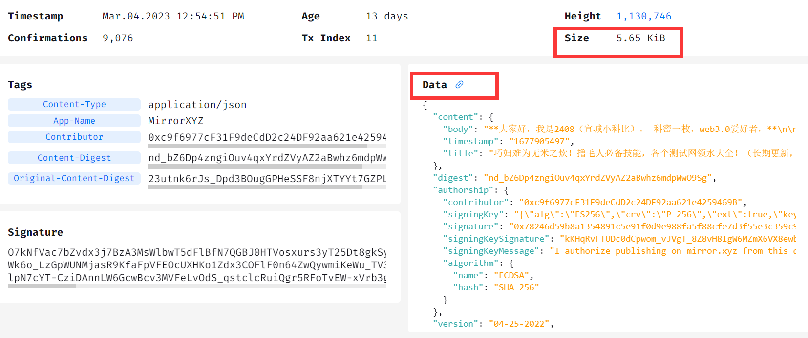
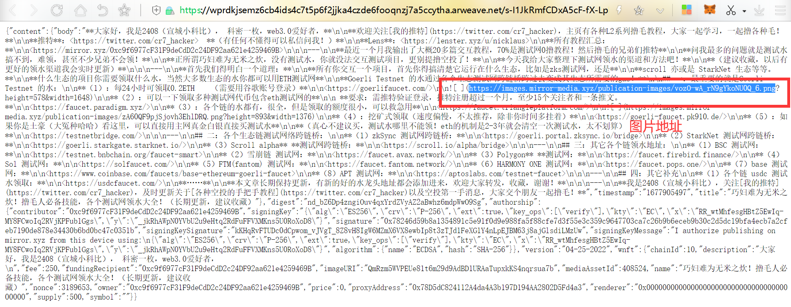
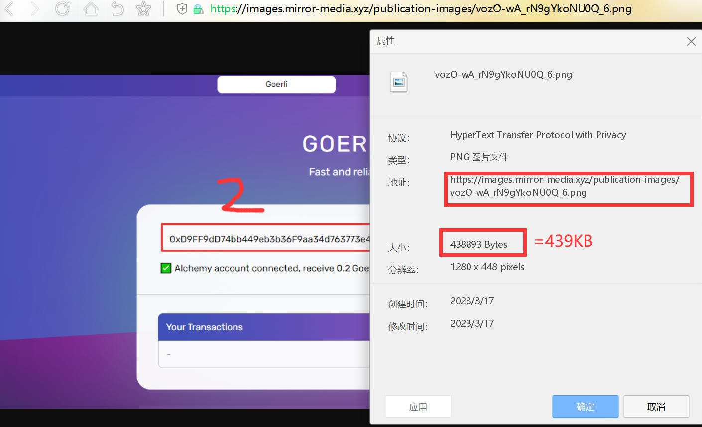

[TOC]

# Mirror会永久存储所有数据吗？

### 前言：

大家可以体验这个好处web3、去中心化的博客Mirror，最大的噱头就是抗审查，永久保存数据，而且还是免费的。

mirror官网：https://mirror.xyz/

具体操作教程网上一大堆，就不再赘述了。

因为我之前有写一个博客（btcjjj.com)后来，因为要学习，所以关停了。写文章最麻烦的事情就是图片管理了。

文字是不会丢失的，但是图片会因为你上传的平台倒闭而丢失，当然你也可以为你的图片付费，但是我想很多人是不愿意这样做的。

我之前遇到一些同学，几百篇文章，图片托管的平台倒闭了，上千张图全挂了，补的贼痛苦。

所以，有一个号称，你只要写，他们帮你托管，还是永久的，谁不心动，大喊：mirror牛逼！

### 正文：

mirror上链，数据存储用的AR，AR是一个号称永久网存储的服务（我觉得在代币没有归零之前，矿工还是愿意工作的，数据应该比一般的私人服务器靠谱）。

我们那这篇文章举例：[测试网领水大全](https://mirror.xyz/0xc9f6977cF31F9deCdD2c24DF92aa621e4259469B/23utnk6rJs_Dpd3BOugGPHeSSF8njXTYYt7GZPLmk_A)

文章下面有AR的哈希值，我们点击前往查看：

https://viewblock.io/arweave/tx/s-I1JkRmfCDxA5cF-fX-LpKVA4LIyeK50G5T8HRCxM4

我们可以看到这篇文章上链的时间，AR手续费，以及数据大小，5.16KB。

想一想，绝对不可能，毕竟一张图就不止这大，除非他里面没有图片。

这数据是一个JSON文件，而且里面的确也没有存储图片，而是存储的图片链接。

mirror的做法是这样的，你上传一篇文章，他先把你里面的图片上传到他自己的服务器。

然后用超链接的形式方在你的文章中，在md文档中该图片链接是可以直接查看的。

最后再把所有的文字打包成JSON，由后台程序统一提交到AR网络存储。

你也可以点击Data数据查看该JSON文件：

我们可以看到他使用的还是MD的语法（因为这的确好渲染网页），而且图片也被转化为了mirror平台的中心化链接，这其实是有风险的，比如mirror网站关停，图片就无法访问了。

图片链接：https://images.mirror-media.xyz/publication-images/vozO-wA_rN9gYkoNU0Q_6.png

我们可以看到该图片大小约为439KB，这就5KB大了多少倍了，而且一篇文章还不止一张图。

所以，mirror不是所有的数据都上链的，图片就直接存在服务器里。

还有一篇文章讨论的比较好：

[Mirror上的内容真的会永存吗？我们存了一张《清明上河图》](https://mirror.xyz/0x4E1a2b9d07c271307ecbEFD21167a97416684690/653lmfNtnsWpbnn7TkjlazkH-qSeZdDN7YqvYikp-40)

### 费用计算：

为什么mirror不存储图片呢？因为贵！还不是一般的贵！

AR的数据保存费用比较高，以当前时间：2023年3月17日为例。

数据费用实时变动，请参考网站：https://viewblock.io/arweave

> Storage Cost（存储费用）
> 0.86 AR/GiB
>
> AR PRICE （代币价格）
> $9.12

0.86*9.12=7.84 美元/G

> 1 美元 ≈ 6.8870 人民币 （更新时间：2023-03-17  数据仅供参考）

7.84*6.89=54.02 元/G

这什么概念，比移动流量还黑。有人要说，他永久给你保存，你大概不了解区块链存储的机制，代币价格越高，矿工就多，你的内容保存就稳定，但是要是代币持续下跌，甚至归零。矿工都走了，你存的东西自然就没有了，又不是没有区块链归零矿工停摆的事情。

所以，对于mirror没有保管图片这件事也情有可原，毕竟太贵了。

所以，去中心化存储最开始是说价格便宜来着，这尼玛比AWS、阿里云贵了多少倍？？？

> 欢迎阅读，更多信息请访问：[网站首页](../../../index.html)