### 前言：

因为不熟悉环境，所以特意去了解了一下，听说Lens很火，什么分布式社交龙头。

看了一些资料，首先你需要一个lens域名NFT才可以接下来玩。

早期可以去mint，现在有钱可以去opensea上面买一个参与。

https://opensea.io/zh-CN/collection/lens-protocol-profiles

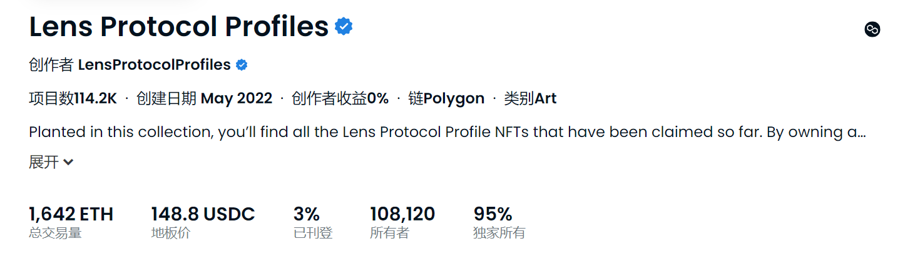

当前项目数114K，持有者108K，地板价148U，总交易量1600ETH。

无论是从分布情况，还是交易情况来看，绝对是一个热门产品，就是现在买太贵了。

### 白嫖方式：（网传）

>  原文请看最后的参考文档。

这是是从lens生态中的Phaver产品来白嫖。（有概率）

#### 1：下载Phaver钱包

安卓直接去谷歌应用市场搜索：phaver

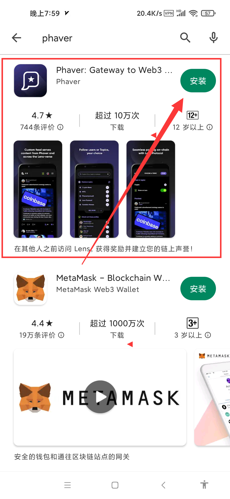

#### 2：填写邀请码：xiansheng

填写邀请码：xiansheng

填写邀请码：xiansheng

填写邀请码：xiansheng

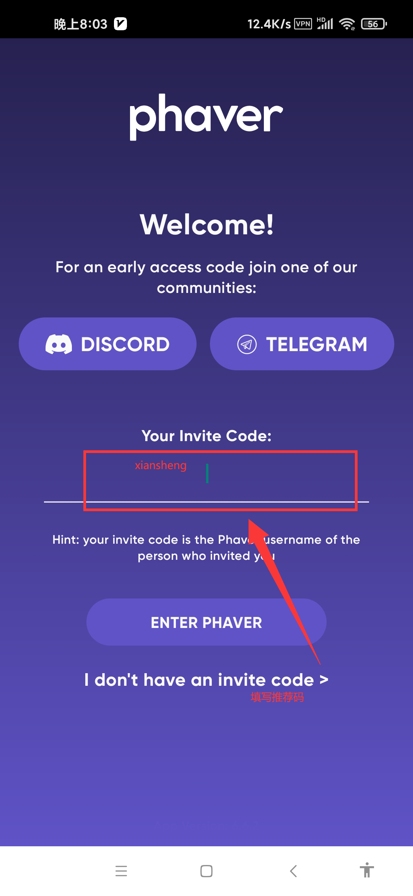

#### 3：注册账号

建议使用邮箱注册。（最上面）

填写账号和密码。

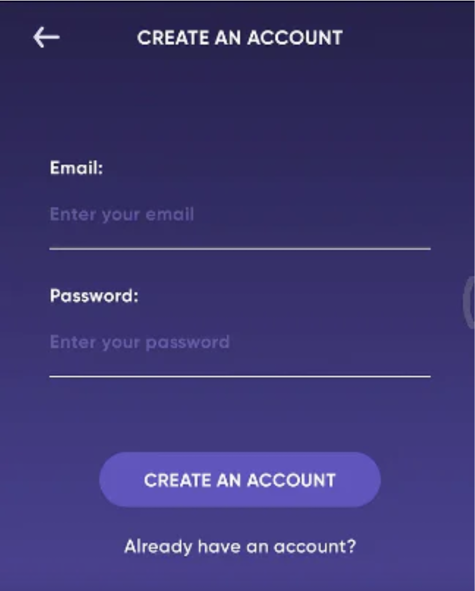

确定用户名和头像（可修改）。

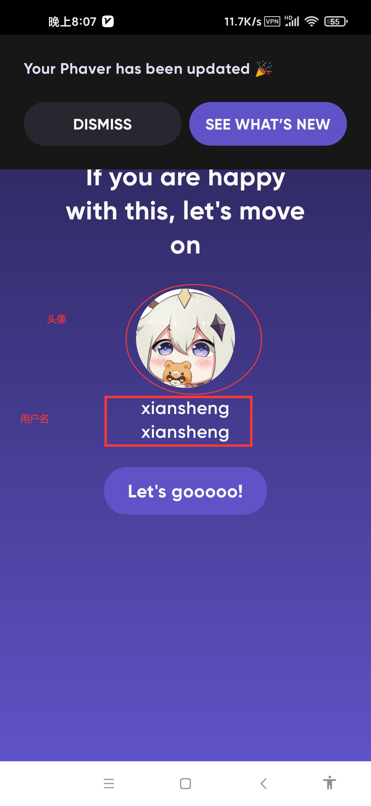

#### 4：社交

选择感兴趣的话题，你可以理解为微博超话。

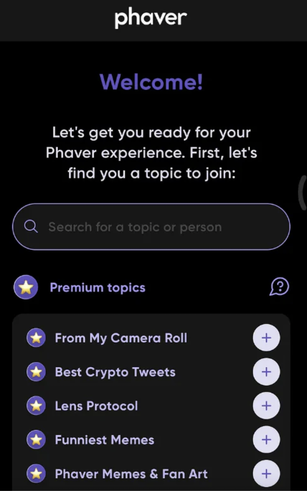

基本社交行为：评论、转发、收集、质押、点赞。（每天有5次质押机会）

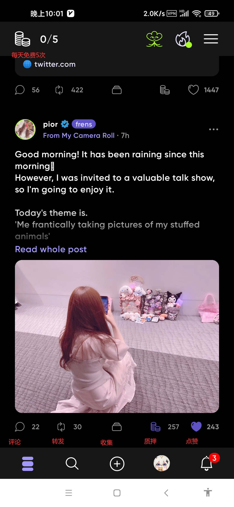

大家可以互关一下，比如笔者：xiansheng

你也可以发帖，点击底部+号，然后选择感兴趣的话题带上（和玩微博一样，就不演示了）。

#### 5：个人信息和等级

点击底部自己的头像。

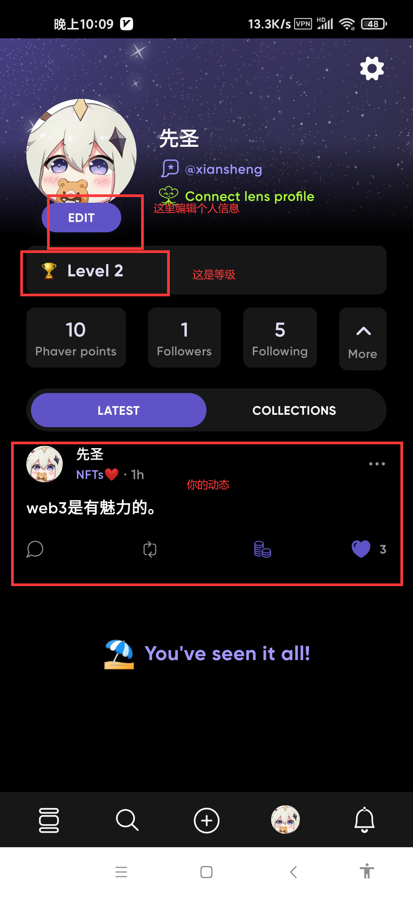

最重要的是，你先升到2级，怎么做呢？

参考文档有几张方法，最简单的一种就是验证Github Passport。

#### 6：Github Passport

电脑打开下面网站（小狐狸插件）：

https://kleoverse.com/

点击connect，授权登录：

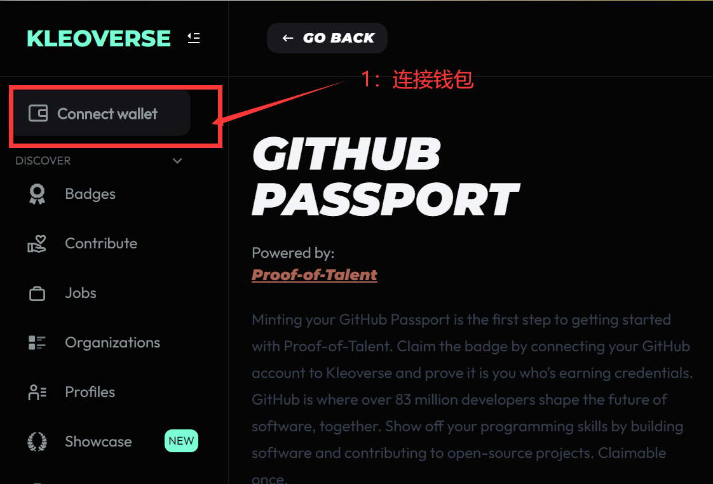

然后，按照点击Badges。

接着下滑，选择Github Passport。

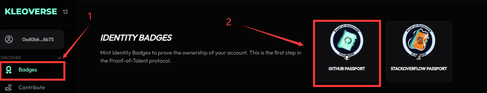

进入网页后，看右边找到下图。

我们授权github账号。（授权过程忘记截图了）

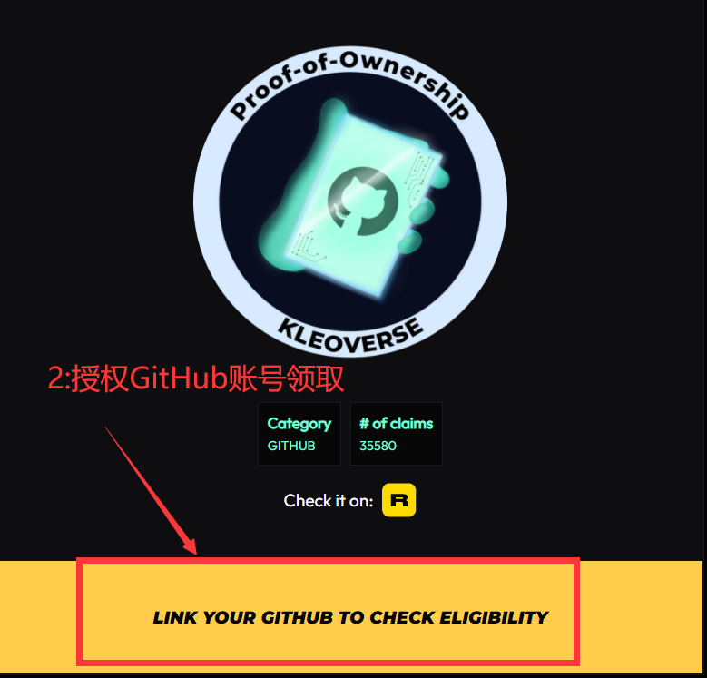

授权成功后，网页会有绿色成功提示。

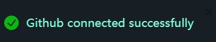

稍等片刻，我们就可以mint了。

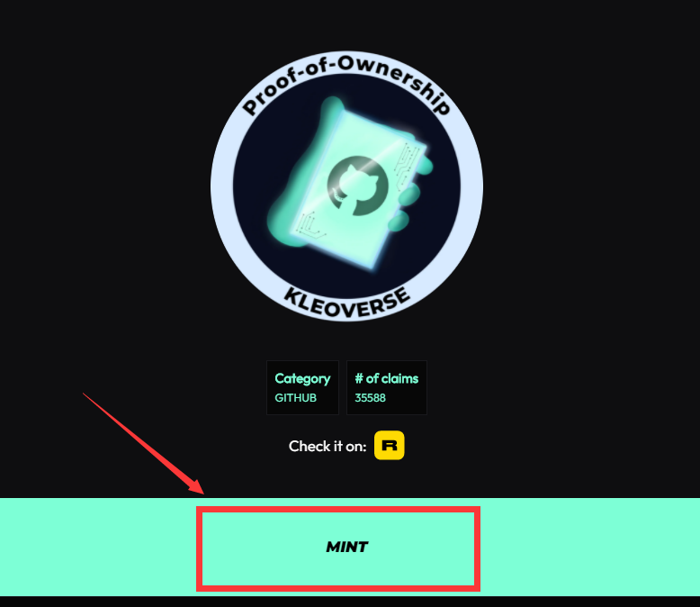

你需要提前添加好Polygon主网。

我们需要一点MATIC作为GAS费用，大概在0.1刀左右，可以向小伙伴买一点，或者直接去交易所提一点。

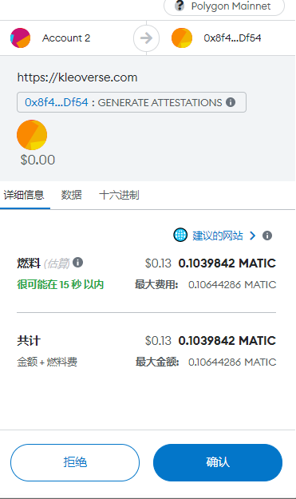

等合约确认成功后，会显示下图。

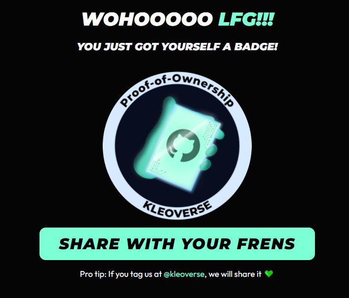

至此，Github Passport申请完成。

#### 7：验证身份

你需要先关闭手机应用Phaver。

然后电脑访问Phaver网站：

https://connect.phaver.com/

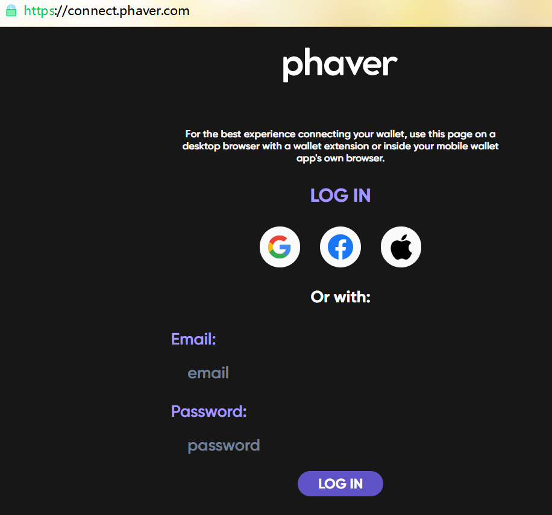

把之前手机上注册的账号和密码填写好登录。

登录不成功，请刷新网页，然后重新输入，再次登录。

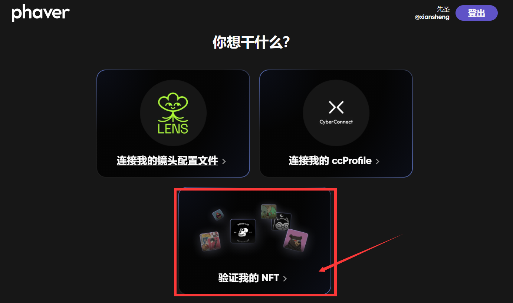

我们选择最下面的 veryfi nft，来验证你的NFT。

然后你点击小狐狸，授权你刚才获取到Github Passport的那个钱包。

如果一切正常，你将会显示下图：

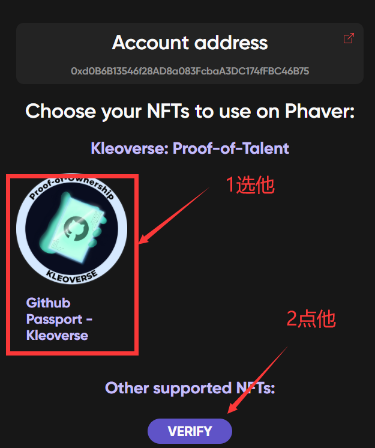

我们勾选Github Passport，然后点击Verify验证。

验证成功，如图所示。

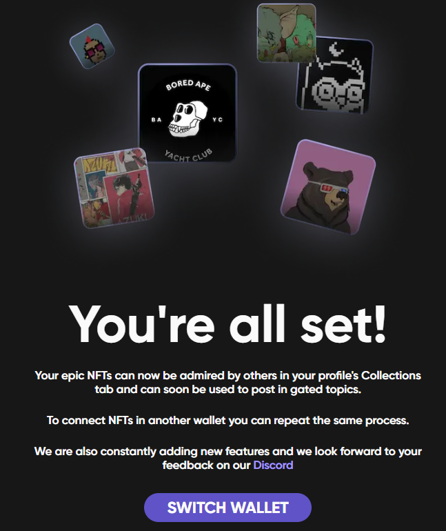

最后，回到手机上查看自己的账号，发现已经到2级。

每天5次质押做一下，花不了多长时间。

> 积分是Phaver App里的重要资产，是通过使用App获得的。发币后积分可按一定规则转换为$GOV。
>
> **积分如何获得**
>
> 1.给其他用户的帖文进行质押。
>
> 2.邀请其他人注册App（使用自己用户名作为邀请码）。
>
> 3.其他用户对自己的优质内容进行质押。

等待下周快照，看看能否白嫖到lens。

### 参考文档：

[Lens应用体验交互](https://bress.xyz/zh/post/5UGKAvZy8tdqUjr7tJub96L-PrK4mIOtTZ2sBVRQ8UQ)

[白撸一个lens白名单](https://bress.xyz/zh/post/5UGKAvZy8tdqUjr7tJub96L-PrK4mIOtTZ2sBVRQ8UQ)

[教你玩转Lens及生态](https://mirror.xyz/3344521.eth/jBU_gqsekM0o5pvIw-xP5ZOQdjFdcduBspsBwWfSaBI)

[一文带你玩转Lens生态——Phaver](https://bress.xyz/zh/post/kYd1Y9G9SbmabHjszvTC4QlMY2emVEFCxcGYZtxCHk4)

> 欢迎阅读，更多信息请访问：[网站首页](../../../index.html)