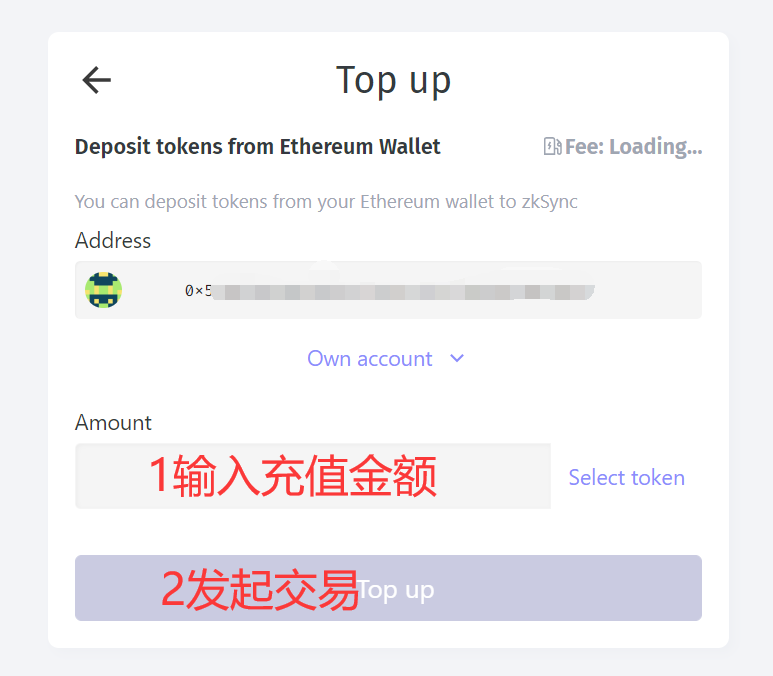
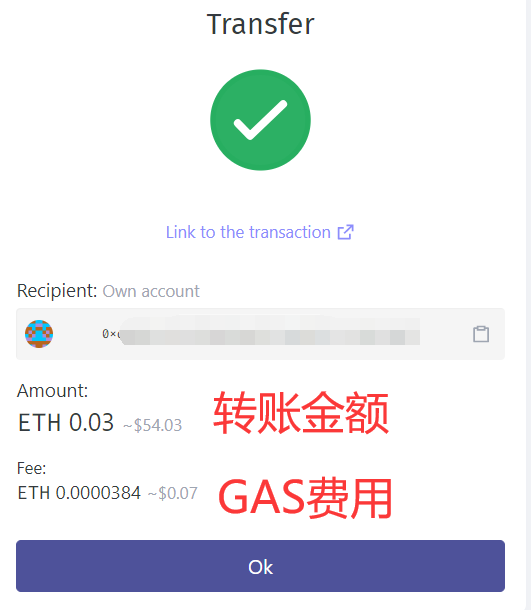
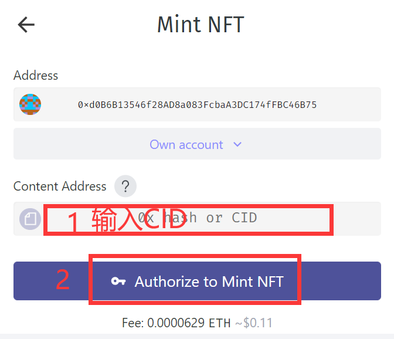
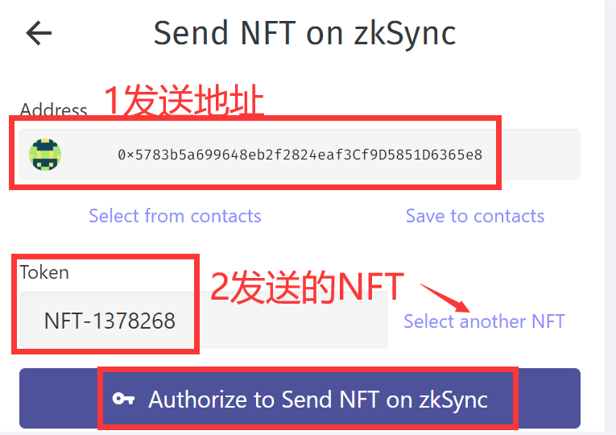
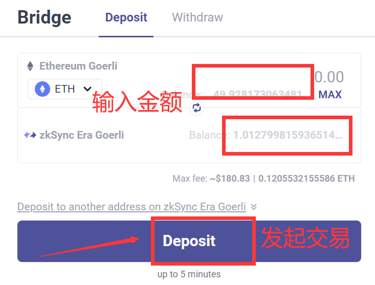
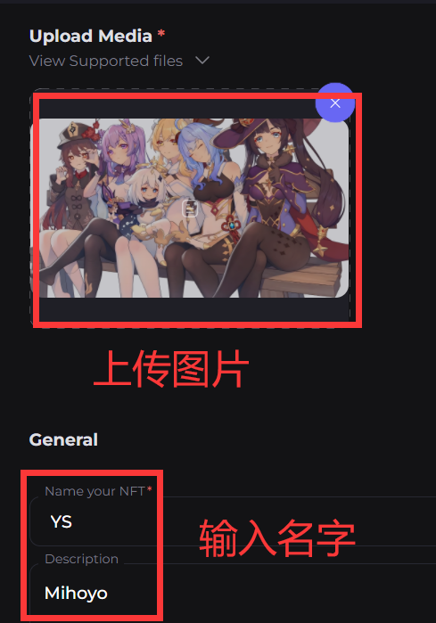
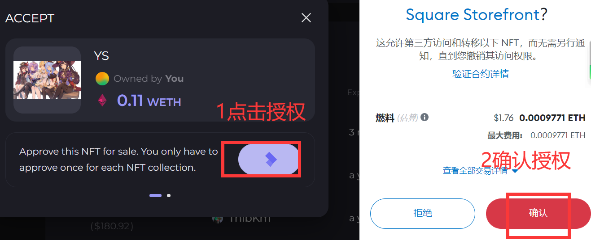
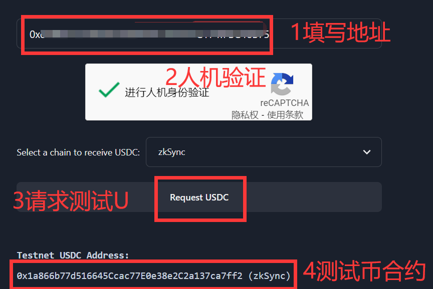

[TOC]

## zksync从零开始撸：

> 笔者本人之前没有撸过该项目，因为个人原因退圈过一段时间。
>
> 所以，完全是从零开始撸，本文会比较长，而且多图（可能加载过慢）。

首先，我们连接一下基本资料。

zksync是一个**L2**的技术产品，旨在降低gas费用，宣传比**ETH主网L1**低100倍。

这里有必要说一下，他们的分类，这个观点是DOT波卡他们提出来的。

> L0：就是做跨链的产品，他们跨链的对象是各大公链主网（L1）。
>
> L1：把其他的公链主网称为L1。
>
> L2：在主网L1的下面利用技术进行扩容。

如果你看波卡的生态会发现，他对外宣传最近的L0，万联联合。其实本质上就是做了一个跨链桥的L1产品而已，这并没有什么伟大的。

早些时候，我们以为侧链就是L2。其实从理论上来说是可以的，但是技术上是两回事，侧链只是单纯的自己搭建了一个链。他的性能并没有得到显著的提升，参考BSC链就是简单的复制ETH主链，当代币价格提高是GAS费用也不可避免的上升。现在的L2产品是，重新部署一条更快的链，将L1的代币跨链到L2上，然后使用L2进行各种交易操作，费用会变得很低。当数据达到一定量或者到了一定的时间，L2的数据可以打包到L1，达到一种效率与证明的和谐。所以，理论上L2的数据没有上传到L1之前是存在风险的，但是这种风险和便利相比不值一提，所有的L2产品都在衡量这个尺度。

### 官网学习：

https://zksync.io/

跨链桥：https://lite.zksync.io/

> 直接使用跨链桥，某个憨憨作者gas费设置低了，等了一个小时.....建议多给一两刀gas费，这等的。

跨链教程：

#### 1：连接钱包

https://lite.zksync.io/

选择小狐狸，链接即可。

#### 2：充值代币

我们需要把主网的ETH充值过去。

你可以选择多种方式充值，比如从交易所提币（窝巢，我当时怎么没有这样做）。

你也可以选择最下面的官方充值渠道：

https://lite.zksync.io/transaction/deposit

#### 3：等待确认到账

>  强烈建议多花两刀GAS费......

至此，充值完成。

实际操作建议跳过4、5步骤（无聊可以看看，没有必要浪费时间）。

#### 4：添加zksync网络（跳过）

我喜欢用小狐狸，不喜欢用其他钱包。

凡是可以用小狐狸的，我都不会去推荐其他钱包，因为两个字：麻烦！

一键添加zksync网络：

https://chainlist.org/?search=zksync

你会惊奇的发现，为什么没有币？？？

这时候，不得不去官网查阅资料。（[资料](https://blog.matter-labs.io/all-aboard-zksync-era-mainnet-8b8964ba7c59)）

> - zkSync 2.0 is now **zkSync Era∎**, and zkSync 1.0 is now **zkSync Lite**

意思是：

zkSync的2.0版本是：zkSync Era

zkSync的1.0版本是：zkSync Lite

我们在跨链桥里面默认充值到了zkSync Era也就是2.0版本里面了。我们可以提现到zkSync Lite也就是1.0版本。

他这个就有意思了，他自己里面还套了一层，搞清楚了就不怕了。

#### 5：从Era到Lite（跳过）

我们看图操作。

我们点击提现。

选择提现到 zkSync lite 上面。

我们授权同意一下。

按图操作，输入地址，金额，然后Send发送。

在发送后授权同意（不截图），几秒后交易发起成功！

还需要等待交易确认，我还是高兴太早了。

我一直等待（直到过了一个小时，我意识到事情的不对劲了）。

我重新仔细的阅读了网站和转账信息，我这不是从Era到Lite，而是Lite到Lite，但是小狐狸默认添加的是Era网络。这尼玛不是血坑吗？？？？

Era的跨链桥是这个网站：

https://portal.zksync.io/bridge

图片的意思是：我们的zkSync Era网络暂时不对普通人开放......

所以，我们现在需要在小狐狸中添加一个Lite的网络配置。

官网上的确是分为了两个时代，但是zkSync Lite居然没有帮助文档，该Docs指向了404错误页。

默认的文档居然是zkSync Era的，但是Era又不对普通用户开放，日了狗。

谁会的话，可以教教我吗？反正我还网上没有找到相关的配置。

#### 6：mint NFT （必做）

打开地址mint NFT :

https://lite.zksync.io/transaction/nft/mint/

什么是CID？

就是IPFS上面的唯一哈希值，我们mint NFT需要上传一张图片（也可以是音乐，视频，货其他文件）。

当我们把图片上传到IPFS时，会返回一个CID，我们把CID复制过来即可。

这里我推荐使用4Everland：

https://dashboard.4everland.org?invite=T5RVBMXX

> 为什么不使用IPFS客户端或者Pinata？
>
> 因为4Everland有可能会有空投，而前面两者希望渺茫。一鱼双吃，所以才推荐必做。

我们登录，用小狐狸授权（如不放心，可以用空钱包），这个网站只是帮你托管文件到IPFS或者AR。

我们只需要拿到上传到IPFS的CID即可，不需要任何代币开销。

我们可以看到，他给我们提供了一些免费的托管服务。

6GB的IPFS文件托管，100MB的AR文件上传。

请注意我的措辞，IPFS是托管（ping），如果到期后没有人继续托管（ping），该文件是有可能被取消的。

AR永久网是上传，一次上传，永久生效（除非该网络彻底无人运行），所以AR的容量小一些是可以接受的。

我们按上图创建一个存储桶 New Bucket。

这里主要注意，如果你想同步到AR，就把开关打开。（建议打开）

存储桶的名字必须是其他人没有起过的。（在此网站中具有唯一性）

看图操作，我们上传文件。

> 上传时请开全局代理，不然可能上传失败。

我们点击复制一下CID，比如：

> bafybeiagdo6vnq56oct3qej5htgowv45xe76kn7zgzg5pzj36llxs3rpmu

我们回到mint NFT的网站，把CID粘贴进去。

mint NFT这样就基本成功了，等待交易被确认就可以了。

交易被确认后可以将NFT发送给其他人（比如小号）。

我们按图操作。

点击Transfer NFT来发送我们的NFT。（卧槽，漫长的验证，建议直接做下面的）

https://lite.zksync.io/transaction/nft/transfer

我们授权解锁下就可以发送了。

发送成功如图，还是一样要等网络确认才是真正的成功。

你可以关闭网页了。

### 测试网络（必撸）：

测试网基本都是一个模式：1领水（测试代币）、2交互。

一般情况下测试网都不需要花费真正的代币，但是自从Goerli有价格后除外。

此次测试网部分排名先后，我做哪个就写到哪个（测试网只花费时间）。

#### 1：zkSync Era Goerli 跨链桥

一般情况下，我们将Goerli通过跨链桥发送到 zkSync Era Goerli 测试网。

（现在Goerli水的确是比较难领取，没水在我推特下面回复我给点手续费）。

https://goerli.portal.zksync.io/bridge

跨链成功后（需要等待一点时间）。

你打开打开网址一键添加到小狐狸：

https://chainlist.org/chain/280

（点击Add  to MetaMask添加）

添加成功后小狐狸可以显示余额就是对的。

#### 2：Mint Square NFT （测试网mintNFT)

**建议忽略跳过，这个项目真坑，可以先看完再考虑做不做。**

为什么第一个做这个，因为上面的mint NFT等待时间太长了，我觉得耗时长的先做比较好。

网站：https://mintsquare.io/zksync-testnet

> 该网站还可以切换网络StarkNet、StarkNet Testnet，记得做StarkNet生态时再来一次。

点击右上角连接钱包，然后再点击mint。

我们需要上传一张图片，然后起个名字，最后记得带上一个网址（填在External Link里面）。

如果你mint出现网络错误的话，请检查一下图片格式是否支持。

这尼玛不是妥妥的坑吗？连jpg都不支持，但是却支持jpeg、png、gif、svg······

好在这个测试网比Lite主网快多了。

然后，我们需要出售掉那个NFT，你可以选择挂单。或者同意别人的出价。

这里我直接同意别人的出价完成交易。

但是事实是，你没有进入白名单，禁止同意。

你只能点击Sell挂单出售，反正也没人买，就这样了。

最后，我们需要购买一个其他人的NFT（选便宜点的，测试代币也是钱）。

https://mintsquare.io/collections/zksync-testnet/rankings

我们就选择默认的集合。

按照价格从低到高排序。

**不要选择默认即可，不能购买。**

**不要选择默认即可，不能购买。**

**不要选择默认即可，不能购买。**

垃圾网站，其他的集合也无法购买，难怪这么多报价的。

我们也可以提供一个报价。（我再做这个网站我就是猪，什么勾八代码写的一塌糊涂）

在购买的下面有一个报价（懒得截图了，毁灭吧）。

#### 3：Mes Protocol测试网

>  Greta推荐的必撸项目，更多看文末的参考资料。

①：打开官网

点击右上角启动应用程序。

https://www.mesprotocol.com/

官方操作指南：

②：连接钱包

https://app.mesprotocol.com/spot/ETH-USDC

点击右上角连接钱包。

③：领取测试代币USDC

https://faucet.mesprotocol.com/

官方说测试U会在5分钟内到账。

大概过了10分钟，文末回到步骤②里面。

已经到账了。

④：充值

你可以理解为充值代币到交易所。

上图是订单薄的模式，你也可以改成兑换池的模式。

考虑到订单更容易理解，就用他演示了。

艹，这测试网的速度堪忧。

如果我这个没有作完，那就是交易速度的锅。（不建议做）

### 参考资料：

[【推特】鸭鸭推文](https://twitter.com/0x_irisl/status/1638100665246580736)

[【幕布】思维导图-鸭鸭](https://mubu.com/doc/3MTrKU9ROrc)

[【谷歌表格】zksync生态](https://docs.google.com/spreadsheets/d/1xatD73XFnwqYxPuX7rbC50VQu88V89AoWJWt2ed36Kw/edit#gid=452477017)